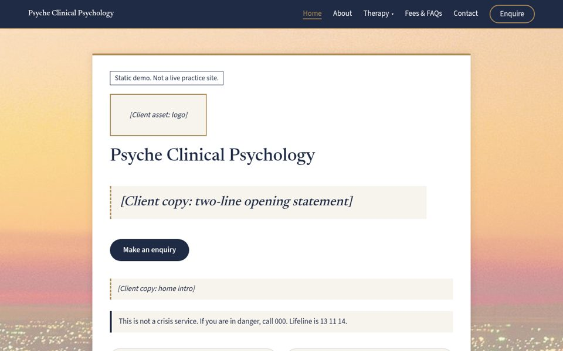
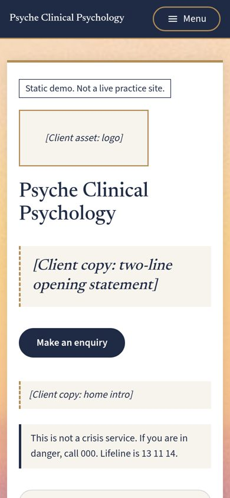
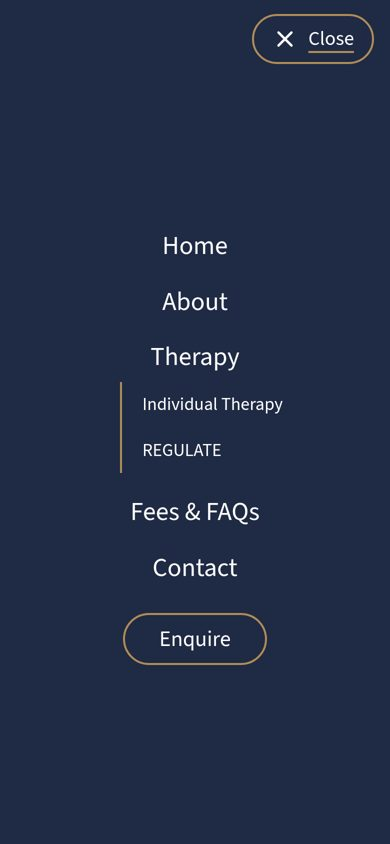
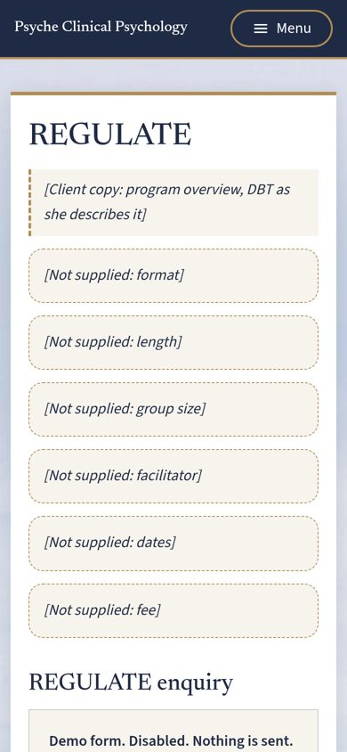
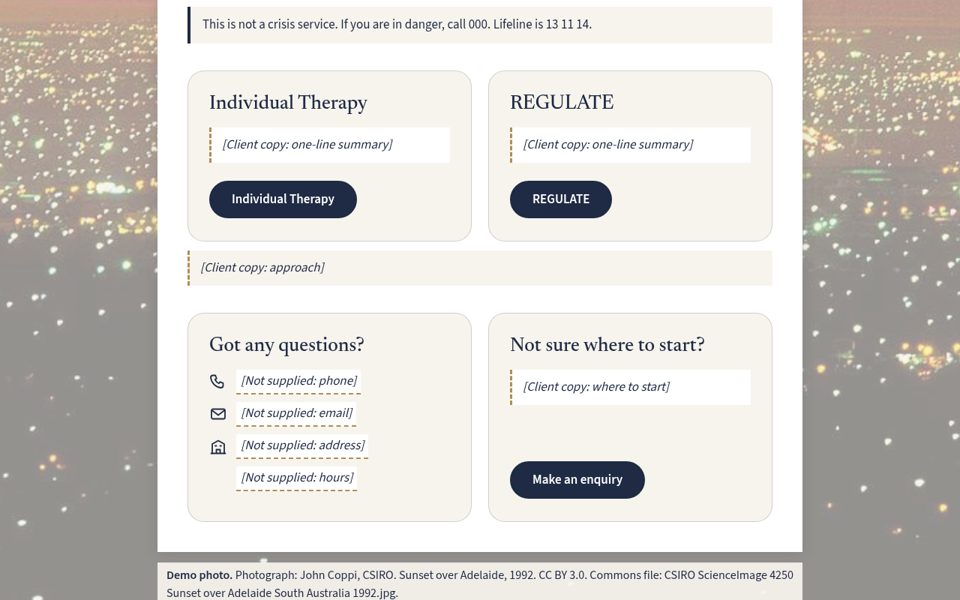

# Psyche Clinical Psychology demo: client-eye audit

**For:** Percy only. Internal. Nothing here goes to the client.  
**Date:** Thursday 8 October 2026, written about 9:30 am (Perth time)  
**File audited:** `psyche-staging/Psyche_Clinical_Psychology_Static_Demo_2026-10-08_phase2-5b.html` (1,489,460 bytes, SHA-256 starts `dc3c36ed`). It's identical to the copy the tester is using in `psyche-1008/test_phase25b/`.  
**How I read it:** I went through the source and rendered it in headless Chrome at 1280 px and 390 px, including the phone menu open, the desktop Therapy dropdown, and a jump from the menu. I also looked at the coder's proof shots and the plan. No demo files were changed.  
**Yardstick:** Freelancer project 40745684, "Consulting Service Website Development" (AUD 250–750, about 400 bids, closing about 9 Oct).  
**Lens:** an Adelaide clinical psychologist opening this demo next to a bid.

> **Two passes in progress since 2.5b:**
>
> 1. **Sample copy (Phase 2.5c).** This landed at about 9:23 am and is now in testing. The file is `psyche-1008/…_phase2-5c.html`, SHA-256 `cf9e9043…`, which matches the Latitude copy. All 26 [Client copy] slots now hold asterisk-wrapped, first-person sample copy. 27 [Not supplied] slots remain, and four sample FAQs were added. I didn't render 2.5c myself. My notes on it come from the coder's diff and checks and are covered in Big change 1.
> 2. **Photo swap (approved, being built).** Three photos are being replaced with daytime colour versions: Home (daytime skyline, public domain), Fees (daytime aerial view toward the hills, CC BY-SA 3.0) and Contact (summer daytime Torrens, CC BY-SA 2.5). Credit lines are being added.
>
> The rendering, screenshots and percentages below are for 2.5b unless stated otherwise.

---

## 0. Bottom line

2.5b is a calm, well-built design shell. It already gets her colours, her six pages and her three forms right, and it handles crisis wording with real care. On its own, though, she'd open a page of square brackets, which reads as unfinished rather than tailored. The 2.5c sample copy fixes the biggest problem. It reads warm and plain and invents no numbers, so the job now is to **review and approve it, and check it invents nothing**, including three wording calls the coder flagged. After that, three things will shape her reaction. First, the link: its address includes the word "cheap", and it still serves the older Phase 2 file. Second, the platform: the demo still hedges ("such as WordPress or Webflow") when she asked for a recommendation. Third, the photos: the daytime swap now under way should make them read as one set, and the two CC BY-SA images need correct on-page credits. Get those right and it's a strong, unusual bid attachment. Leave them and it risks getting lost among 400 bids.

---

## 1. Big changes before sending (ranked)

**Verdict:** four changes, each one shaping her first impression. Number 1 is now a review job rather than a writing job, but it still matters most.

| # | Change | Why it matters to her | What "done" looks like |
|---|---|---|---|
| 1 | **Review and approve the asterisked sample copy (2.5c), and check it invents nothing.** | Sample copy turns a wireframe into something she can picture as hers. It's also where a regulated clinician will judge whether you "get" her profession. One wrong implied fact under her name costs more trust than a blank slot. | Percy has read every sample line and confirmed it's only structure, tone and general description. The three flagged items are decided (see below). A visible line tells her the asterisked text is sample wording for her to replace. Without that line, the asterisks alone could read as a typo or as text we wrote "for" her. Testing passes on 2.5c. |
| 2 | **Fix the link she'll open.** | The temporary address is `apps-cheap-initially-standard.trycloudflare.com`. "Cheap" in the URL of a bid for a "clean, sophisticated" site is an own goal. The link also serves Phase 2, not 2.5b or 2.5c (I checked the live hash against `psyche-public/index.html`), so she wouldn't see the design pass or the sample copy. Quick tunnels also drop whenever the box process stops. | The final tested file is on a stable, neutral address, for example a Cloudflare Pages project or a subdomain of Percy's own. The hash is checked after upload, and it opens cleanly on a phone over mobile data. |
| 3 | **Answer "which platform?" with one recommendation.** | She asked directly. The footer says "such as WordPress or Webflow", which reads as undecided. She wants to edit it herself and own it, so a clear pick with a one-line reason builds trust. | Percy picks one; the plan leans WordPress. The footer note and the bid both name it, with one reason (she edits and owns it) and the handover guide mentioned. The bid, not the demo, covers what's included, the timeframe and real portfolio links. |
| 4 | **Land the photo swap cleanly, with correct licences.** | Imagery is where "sophisticated" is won or lost. In 2.5b, Home is an orange sunset and Fees and Contact are black-and-white shots from 1916–17, next to 1990s daytime colour shots. The approved swap (in progress) should make the set read as one. | The three daytime photos are in place. Each credit names the author, licence and source. For the two **CC BY-SA** images (Fees 3.0, Contact 2.5), the attribution is on the page and links or names the licence, as the share-alike terms require. If either image is cropped or edited as a file, rather than just faded with CSS, the edit is noted and the edited image carries the same licence. The veil strength looks even across all six pages. The hidden Government House photo is assigned or deleted (see 4.8). |

**Sample copy: notes on 2.5c** (from the diff and the coder's checks: no banned terms, no digits, crisis FAQ unchanged, titles, headings, buttons and nav identical):

- **"I offer", "time with me" and similar first-person lines imply a solo practitioner.** We don't know that from the brief. The REGULATE copy rightly avoids "I". Either keep "I" and tell her we've assumed it, or switch Home, About and Individual Therapy to neutral or "we" wording. *Percy decides*. I lean towards keeping "I" plus a note, because it reads warmer.
- **"In our first session … we agree on a plan together" (Individual) and "we agree on a focus together and review it" (About)** describe her clinical process. They're gentle and common, but still a claim about how she works. Keep them, but list them in the note to her as "please check this matches how you work".
- **Fees meta: "Fee details and answers to common questions…"** It's fine as a page description, and every fee is still a [Not supplied] slot. It only needs a check that the live Fees page will actually show fees.
- **Also check:** the REGULATE line names four skill areas (strong emotions, hard moments, staying present, relationships). That matches DBT in general, but it implies her program covers all four. The sample FAQ "I'll read your message and get back to you about next steps" promises a reply, with no timeframe, which is fine. The Home statement "A calm, unhurried space to talk" is good and makes no claims.
- **Good calls:** registration, privacy policy and intake dates stay as [Not supplied] slots inside the sample lines. No credentials, modalities beyond DBT (which is in the brief), fees, outcomes or contact details are invented.

*Close fifth, if time allows:* trim the visible demo scaffolding. See 2(e) and Section 6.

---

## 2. Minor stylistic tweaks

**Verdict:** these are polish, not blockers. Each is quick in the template.

a. **REGULATE facts on mobile.** At 390 px the six [Not supplied] facts become six tall dashed boxes in a row (see the screenshot). Use two columns on phones or a compact list. This still matters after 2.5c, because those slots stay "Not supplied".

b. **Photo credits.** Each page ends with a 16 px credit panel in a pale box, which is quite loud for fine print. Make it smaller and quieter, or collect all seven credits in one footer list. That still satisfies CC BY.

c. **St Peter's alt text.** It says "St Peter's Cathedral, Adelaide", but the credit correctly says North Adelaide. Change the alt text to North Adelaide.

d. **Card pills repeat the heading.** Each Home card has an "Individual Therapy" heading above an "Individual Therapy" button, and the same for REGULATE. This was resolved as "keep", which is fine. But a softer label (for example "Read more", marked proposed) would look more finished. Optional.

e. **The crisis line appears eight times in one scroll.** That's one per page (on Contact it's the set-apart box), the FAQ answer, and the footer. On a live multi-page site, once per page is right. In a one-page demo she sees it repeat. Consider keeping it on Home, the FAQ, Contact and the footer only. *Percy decides*, since safety wording is a judgement call.

Also noticed: after you tap "Menu", the phone menu's Close pill shows its gold hover underline. It's tiny, so skip it if time is short.

---

## 3. Visual design against "clean, sophisticated, service-oriented"

**Verdict:** clean and service-oriented: yes. Sophisticated: nearly. The layout and type are there. In 2.5b, the photos and the bracket slots hold it back, and both are now being fixed.

<figure><figcaption>1280 px, Home first screen (2.5b)</figcaption></figure>

| Area | Verdict | Notes |
|---|---|---|
| **Palette** | Good | Navy #1F2A44 bar, footer, text and buttons. Gold #B08D57 only on rules, borders, outlines and the current-page underline, never on small body text. Light #F7F4EE page, with white content boxes. That's the brief's "deep navy, gold, light neutrals", read with restraint. Clearly labelled provisional in the source until her brand values arrive. |
| **Type** | Good | Newsreader serif headings (h1 40 px, h2 28 px) over Source Sans 3 body at 17 px. The pairing feels professional and quietly premium. The 30 px serif opening-statement slot is a nice touch, but it's empty until 2.5c fills it. |
| **Spacing** | Good | Generous padding, an 860 px content column, 22 px rounded cards. The six Phase 2.5 patterns (statement slot, rounded cards, pills, closing cards, full-screen phone menu, split slots) all render as described, and they help. |
| **Imagery** | Weakest area in 2.5b, being fixed | In 2.5b, Home's orange sunset pulls against navy and gold, and Fees and Contact are black-and-white archive shots. The approved daytime swap (in progress) should fix the mismatch (Big change 4). The faded veil keeps text readable everywhere. Leaving out stock people, photos inside cards and overlapping headers was right for her profession. |
| **Hierarchy** | Mixed (2.5b) | The structure is clear: name, statement, one pill, intro, crisis line, two service cards, closing cards. In 2.5b the dashed slot boxes carry the same visual weight as real content. 2.5c keeps the dashed box but sets the sample text upright, which helps. Once she approves the copy, consider dropping the box around sample text so it reads as real content. |
| **Mobile** | Good | No sideways scroll at 390 px. Cards stack, and the navy full-screen menu is calm and easy to tap, with Therapy nesting its two sub-items. Long, though: about 11,600 px of scroll at 390 px against about 9,100 px at 1280 px. |

<figure><figcaption>390 px, Home</figcaption></figure>
<figure><figcaption>390 px, phone menu open</figcaption></figure>
<figure><figcaption>390 px, REGULATE after a menu tap</figcaption></figure>

---

## 4. Architecture and dynamic functionality

**Verdict:** the information architecture matches her brief exactly. The functionality is honestly signposted, not working: there's no CMS, the forms don't submit, no spam protection is active, and there's no booking link. That's the right call for a demo, as long as the bid says plainly what the real build adds.

| Area | What the file does | What she'd still need |
|---|---|---|
| **4.1 Page structure** | Six sections in one file: Home, About, Individual Therapy, REGULATE, Fees & FAQs, Contact. Only the FAQs fold open and closed. | Six real pages on the CMS. |
| **4.2 Navigation** | A sticky navy bar with the practice name, Home, About, a Therapy dropdown (native details/summary), Fees & FAQs, Contact and a gold-outlined Enquire pill. The phone menu is a full-screen navy overlay driven by CSS `:target`, with no script. | Known limits, all confirmed: the dropdown and phone menu stay open until closed; the desktop gold highlight follows the last anchor jump, not scrolling; the phone menu has no current-page highlight; it relies on `:has()`, so it needs a modern browser. Escape doesn't close the menu, and focus isn't held inside it. |
| **4.3 Forms** | Three forms (Individual, REGULATE, General), each disabled inside a `fieldset`, with no action or method. Fields: name, email, optional phone, preferred contact method, an optional short message with a "don't include detailed health information" hint, and consent with a privacy-policy slot. Each has the "not monitored for emergencies / does not book" note. General adds a Subject select (General question / Referral / Other). REGULATE carries an [Not supplied: intake dates] slot. | Working forms, routing to her email, a privacy policy, and a decision on who receives each form. |
| **4.4 Spam** | A proposed note on each form: a hidden check field plus a CAPTCHA service (Turnstile or reCAPTCHA) on the live site. "Nothing is active in this demo." | Real protection in the build. **None is active now.** |
| **4.5 SEO** | The page `<title>` is "Psyche Clinical Psychology, Adelaide". A visible footer "SEO plan (demo)" lists six page titles, with the meta descriptions as slots. The head meta description is literally `[Client copy: one-sentence practice description]`. Every photo has descriptive alt text through `role="img"` and `aria-label`. | Per-page titles, meta descriptions and alt text set in the CMS, plus a sitemap. Until 2.5c, a link preview of the demo could show the bracket text. There's no favicon and no social-preview tags, so a shared link looks bare. |
| **4.6 Booking** | The Contact note says sessions are arranged after enquiry, there's no public calendar, and the live site can link to or embed her system "once named". | A link or embed for her named system. Her system isn't in the brief, so it's rightly not named. |
| **4.7 CMS path** | Only the footer note says so. It's a static HTML file, not a CMS. | The real build and the handover guide (Phase 3 of the plan). She can't test self-editing from this demo. |
| **4.8 Weight and speed** | 1.49 MB in one file. Gzip only gets it to about 1.10 MB, because the photos (data URIs) don't compress. About 315 KB of that is the **hidden, unassigned Government House photo**, which still downloads on every visit. Google Fonts load from Google's servers. | Assigning or deleting the hidden photo saves about a fifth of the file. The live site would use properly sized, compressed images and could host its fonts locally. |
| **4.9 Accessibility** | Good basics: `lang="en-AU"`, labelled fields, visible navy or gold focus rings, contrast stated in the source (white on navy 14.26:1, gold on navy 4.61:1), and one h1 per section. | There's no skip-to-content link. Disabled fields can't be focused, so a screen-reader user can't explore the forms. That's acceptable in a demo; fix both in the build. |

**What a static, no-script demo can show:** look and feel, page set, navigation shape, form design, crisis-safety wording, mobile behaviour, SEO intent.
**What it can't show:** self-editing, submission and delivery, spam blocking, booking integration, real speed, and ownership or handover.

---

## 5. What we've done right

**Verdict:** the foundations are unusually thoughtful for a bid demo, and most competing bids won't have one at all.

- **Her brief, page for page.** All six pages are present, with her names for them, including "REGULATE".
- **Restrained palette.** Navy, gold and light, with gold kept to accents.
- **Three forms, not one.** Each is the right length and avoids clinical questions, with a health-information caution and emergency and booking notes. That shows you understand a psychology practice.
- **Crisis wording.** Plain, correct, on every page: 000 and Lifeline 13 11 14.
- **Nothing invented.** No fake fees, credentials, phone numbers, testimonials or stock smiling faces. A clinician will notice and respect that.
- **Honest labelling.** "Static demo", disabled forms, spam, booking and CMS marked as proposals.
- **Good editorial calls.** Leaving out the top contact strip, overlapping headers and photos in cards keeps it calm.
- **Licensed photos.** Creative Commons Adelaide landmarks with full credits, and no people.
- **Process.** No script and an AA contrast check, with a disciplined write-then-test loop on every phase.

<figure><figcaption>1280 px, Home therapy cards and closing cards</figcaption></figure>

---

## 6. What we've done wrong, or the risks

**Verdict:** the biggest risk isn't a defect. It's that she reads the demo as empty, or as "more about the builder than about me".

| Risk | How it could land with her | Mitigation |
|---|---|---|
| **Placeholder-heavy reads as empty** | In 2.5b, about 48 brackets look like a wireframe. With 400 bids, she may give each one well under a minute. 2.5c still has 27 [Not supplied] slots, which is fine for facts, but they're still visible. | Ship 2.5c, not 2.5b (Big change 1). |
| **Sample copy assumes or over-claims** | Sample copy speaking as "I" when the practice may have others, or describing a process she doesn't follow, could cost trust instantly with a regulated health professional. | Decide the three flagged items. Add a visible "sample wording" line. Anything factual stays [Not supplied]. |
| **Scaffolding shows** | The footer "SEO plan (demo)" block, three spam notes, three "Demo form. Disabled." flags and seven credit panels read as our working notes. | Shrink the SEO block to one line ("titles and meta descriptions planned per page"), or keep it and frame it as a feature. *Percy decides.* |
| **Hedged platform answer** | "Such as WordPress or Webflow" reads as undecided. | One recommendation (Big change 3). |
| **Photos and licences** | In 2.5b they're mismatched and dated, and the swap is in progress. CC BY-SA images need correct on-page attribution, and share-alike terms apply to any edited copy. | Big change 4. Say in the bid that her own photography replaces them. |
| **Link and version** | "Cheap" URL. The old Phase 2 file is live. The tunnel can drop. | Big change 2. |
| **Time** | Bidding closes about 9 Oct. 2.5b and 2.5c are both in testing, and the photo swap is still being built. Each extra phase risks missing the window or shipping untested. | Freeze scope after 2.5c and the photos. Test once, publish once, bid. |
| **Competition and price** | About 400 bids on AUD 250–750 means many cheaper, faster offers. A demo only helps if it's quick to grasp. | Lead the bid with one sentence and the link. Keep the demo's first screen strong. |
| **Static vs her ask** | She asked for a CMS she can edit. A static file can't prove that. | The bid explains what Phase 3 delivers, plus the handover guide and her ownership. |

---

## 7. How close the demo is to ready to send

**Estimate: about 55% for 2.5b on its own, about 70% for 2.5c once it passes testing, and about 80% once the photo swap lands.** These are judgements, not measurements.

Structure, palette, type, navigation, forms, safety wording and mobile behaviour were essentially done in 2.5b, and that's most of the build effort. 2.5c adds the readable content that decides her first ten seconds. The photo swap fixes the main visual weakness. The remaining gap is mostly a link she'd trust, a decided platform answer, and Percy's sign-off on the sample wording.

**Shortest path to ready:**

1. Finish testing 2.5c. Decide the three flagged wording items, and add a one-line "asterisked text is sample wording for you to replace" note.
2. Land the photo swap on top of 2.5c, not on 2.5b. Check all six credits, with BY-SA licence names or links for Fees and Contact. Assign or delete Government House.
3. Quick wins in the same pass: North Adelaide alt text, REGULATE facts on mobile, quieter credits, a one-recommendation platform line.
4. Test once. Publish the final file to a stable, neutral URL, check the hash, then check it on a real phone.
5. Write the bid answering her four questions (platform, inclusions, timeframe, real portfolio links), with the demo link near the top.

---

## 8. How close it is to her ideal version

**Estimate: about 25–30% of what she actually asked for.** Again, a judgement.

| Her brief item | Can a demo show it? | Status in 2.5b |
|---|---|---|
| Clean, sophisticated, service-oriented look | Yes | Mostly there. Held back by the photos and placeholders. |
| Navy, gold, light neutrals | Yes | Done (provisional values). |
| Six pages, right names | Yes | Done. |
| Three forms | Design yes, function no | Designed, disabled. |
| Mobile-friendly | Yes | Done. |
| Her logo, copy and photography | Only once she supplies them | Slots only. 2.5c adds sample copy, not hers, and the photos are still demo landmarks. |
| Editable CMS (WordPress or Webflow) | No | Not started. Static file. |
| Spam protection | No | Note only. |
| Booking-system integration | No | Note only. System not named. |
| Basic SEO in place | Partly | Titles planned, alt text done. Metas are slots in 2.5b and sample text in 2.5c. |
| Fast | Partly | 1.49 MB single file. The real build would be lighter. |
| Ownership and handover guide | No | Planned (plan Phase 3). |

Of the part a demo *can* show, 2.5b covers perhaps 70%, and 2.5c with the new photos perhaps 85%. That moves the overall figure only a few points, to around 30%. The rest of her ideal only arrives with the real CMS build: her branding, content and photos in place, working and protected forms, a booking link, SEO settings, speed tuning and the handover. So the demo's job is to make her trust Percy to deliver that. It can't deliver it itself.

---

### Facts in the file that differ from, or add to, the brief Percy was given

- **Live link.** It serves the Phase 2 file. The hash matches `psyche-public/index.html` (`c3adec90…`). The plan document still says the link is the 3 October file, so that line in the plan is out of date.
- **Head meta description.** In 2.5b it's a bracket slot, `[Client copy: one-sentence practice description]`, not empty. In 2.5c it's sample copy.
- **Extra form fields.** The General form has a Subject select (General question / Referral / Other), and the REGULATE form has an [Not supplied: intake dates] slot. Both are consistent with the plan.
- **Closing cards.** "Got any questions?" and "Not sure where to start?" appear on **Home and Contact only**. Hours has no icon.
- **Crisis line count.** It appears eight times in total: one per page (Contact's is the set-apart box), the FAQ answer, and the footer.
- **Photo licences.** In 2.5b all six visible photos are CC BY 3.0 or CC0, and Government House is CC BY 3.0. The incoming swap adds CC BY-SA 3.0 (Fees) and CC BY-SA 2.5 (Contact).
- **Hidden photo weight.** Government House is held in an inert `<template>`, but its roughly 315 KB still ships in the file.
- **Accessibility gaps.** No skip link, favicon or social-preview tags.
- **Slot count.** About 48 visible bracket slots in 2.5b, which matches the brief: 25 [Client copy] plus 21 [Not supplied] by the coder's count, plus the logo and portrait slots. 2.5c has 0 [Client copy] and 27 [Not supplied]. Six new [Not supplied] slots (registration, privacy policy x4, intake dates) sit inside sample lines. The "26 [Client copy]" figure in the 2.5c handover equals 25 visible slots plus the head meta.
